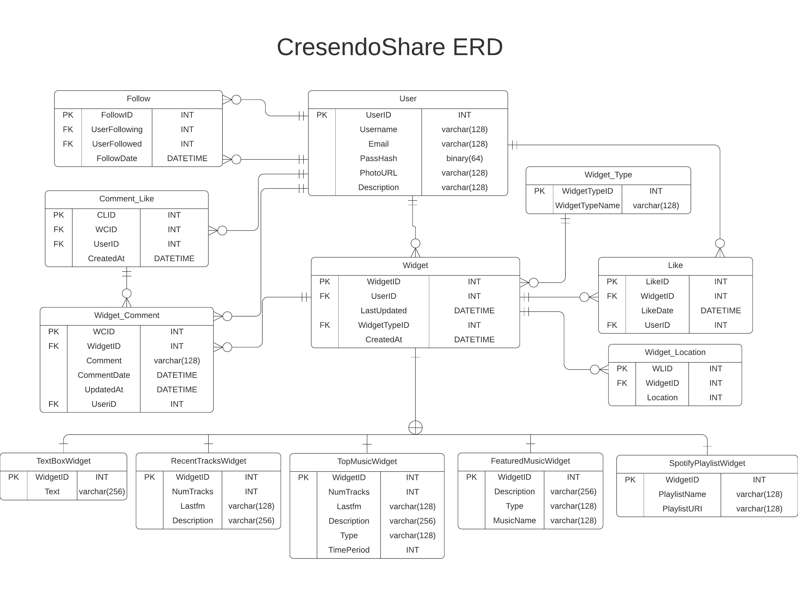

# CresendoShare
[Backend](https://api.cahillaw.me)

## Project Description
#### Context
Currently, there is no platform that allows people to share and engage with others about what music they are currently listening to. There are three platforms that have some some social features, however they all have large limitations; Spotify allows users to follow others, however there is not much you can see beyond seeing public playlists, of which most playlists are private. It is impossible to organize your playlists in a way that emphasizes certain ones over others. Last.fm is a platform that allows users to track their listening, however it is mostly a stats site, with little ways of interacting with others. Soundcloud has the most social functionalities, however it is limited to songs on Soundcloud, and a large percentage of songs are not on Soundcloud. 
#### Functionality
CresendoShare is a social platform that lets each user customize a music sharing dashboard, with many “widgets” that show different information. These widgets will fetch data from external sources (Spotify and Last.fm) on the front-end, guaranteeing that information will be updated every time you view the site. The user can also specify where on the page to put each widget, allowing for further customization. These widgets range from specific track spotlight, most listened to songs over a time period (from Last.fm api), featured playlist (from Spotify api), recently listened to tracks (from Last.fm) and more. Users can also follow other users, comment and like widgets, and like other user's comments, allowing for social interaction between users. 
#### Justification 
The target audience is threefold; for those who want an outlet to show their musical taste, for those who are interested in what their friends or favorite influencers are listening to, and for those who want to discover new music. People love to share things they are interested in and interact with others, (see Instagram, Twitter) and many people are also especially passionate about the music they listen to, so a platform that combines the two seems like a no-brainer. 

## Backend Endpoints
#### Widget Endpoints
*All widget creation and edit endpoints include location, all edit endpoints all for edits of all input parameters*

**POST /v1/widgets/textbox** Creates a new textbox widget; body input: text.

**GET /v1/widgets/textbox/{widgetID}** Gets information regarding a textbox widget.

**PATCH /v1/widgets/textbox/{widgetID}** Edits a textbox widget.

**DELETE /v1/widgets/textbox/{widgetID}** Deletes a textbox widget.

----

**POST /v1/widgets/recenttracks** Creates a new recent tracks widget; body inputs: number of tracks, last.fm username, description.

**GET /v1/widgets/recenttracks{widgetID}** Gets information regarding a recenttracks widget.

**PATCH /v1/widgets/recenttracks/{widgetID}** Edits a recenttrackswidget.

**DELETE /v1/widgets/recenttracks/{widgetID}** Deletes a recenttracks widget.

----

**POST /v1/widgets/topmusic** Creates a new top music widget; body inputs: number of tracks, last.fm username, description, type(artist, album, song), timeperiod (in days).

**GET /v1/widgets/topmusic/{widgetID}** Gets information regarding a top music widget.

**PATCH /v1/widgets/topmusic/{widgetID}** Edits a top music widget.

**DELETE /v1/widgets/topmusic/{widgetID}** Deletes a top musicwidget.

----

**POST /v1/widgets/spotifyplaylist** Creates a new spotify playlist widget; body inputs: number of tracks, description, spotify playlist uri, playlist order.

**GET /v1/widgets/spotifyplaylist{widgetID}** Gets information regarding a spotify playlist widget.

**PATCH /v1/widgets/spotifyplaylist/{widgetID}** Edits a spotify playlist widget.

**DELETE /v1/widgets/spotifyplaylist/{widgetID}** Deletes a spotify playlist widget.

----

**POST /v1/widgets/featuredmusic** Creates a new featured music widget; body inputs: description, type(artist, album, song), name (of type).

**GET /v1/widgets/featuredmusic/{widgetID}** Gets information regarding a featured music widget.
**PATCH /v1/widgets/featuredmusic/{widgetID}** Edits a featured music widget.

**DELETE /v1/widgets/featuredmusic/{widgetID}** Deletes a featured music widget.

----

#### Social Endpoints
**POST /v1/widgets/{widgetID}/like** Likes a widget.

**DELETE /v1/widgets/{widgetID}/like** Unlikes a widget.

----

**POST /v1/widgets/{widgetID}/comment** Adds a comment to the specified widget; body input: comment.

**GET /v1/comments/{commentID}** Gets comment information for the specified comment.

**PATCH /v1/comments/{commentID}** Edits specified comment.

**DELETE /v1/comments/{commentID}** Deletes specified comment.

----

**POST /v1/comments/{commentID}/like** Likes a comment on a widget.

**DELETE /v1/comments/{commentID}/like** Unlikes a comment on a widget.

----

**POST /v1/users/{userID}** Follows a user; if user was already followed, it unfollows.

----

**GET /v1/profile/{userID}** Returns all information needed to load a page, including all widgets, comments, has booleans for if the user that requested the page has liked it, etc.

----

#### Also has all user/session endpoints from a4

## Architectural Diagram

## Database Schema

